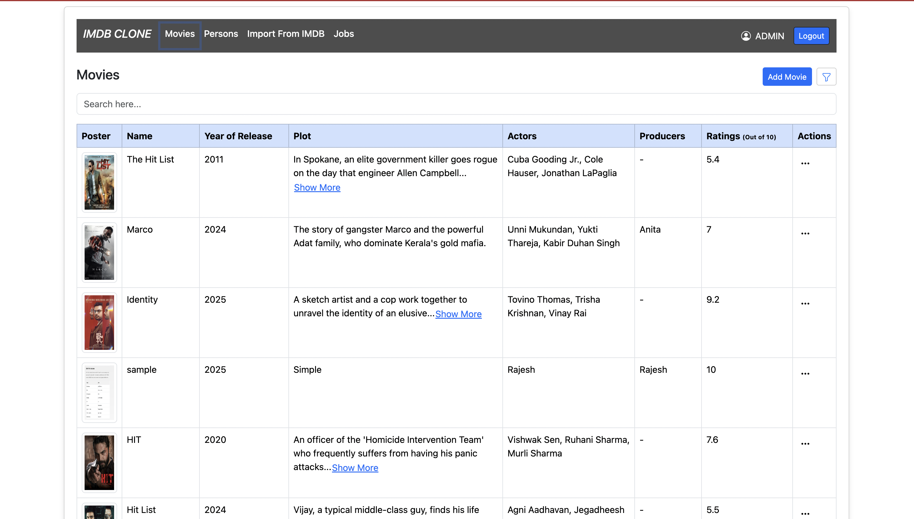
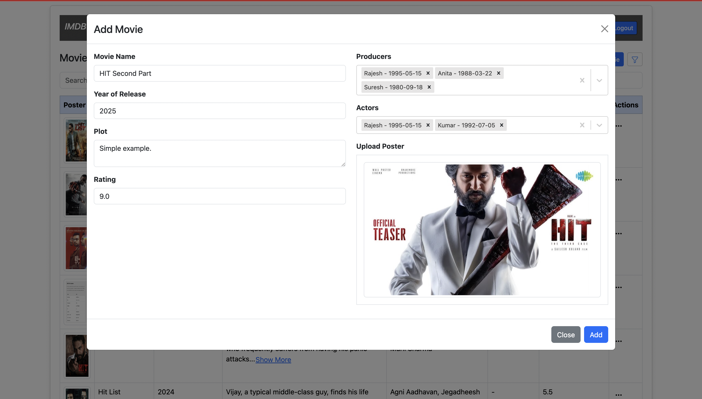
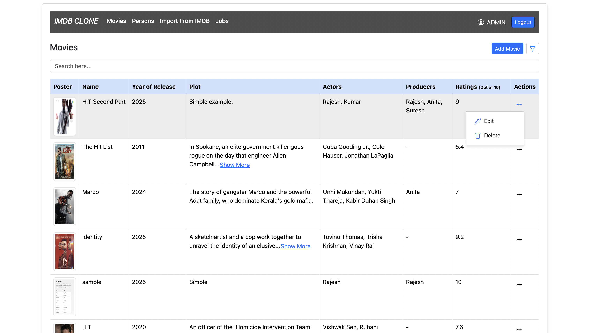
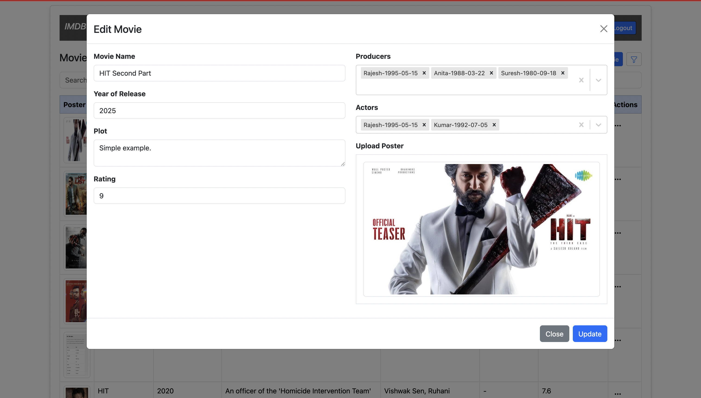
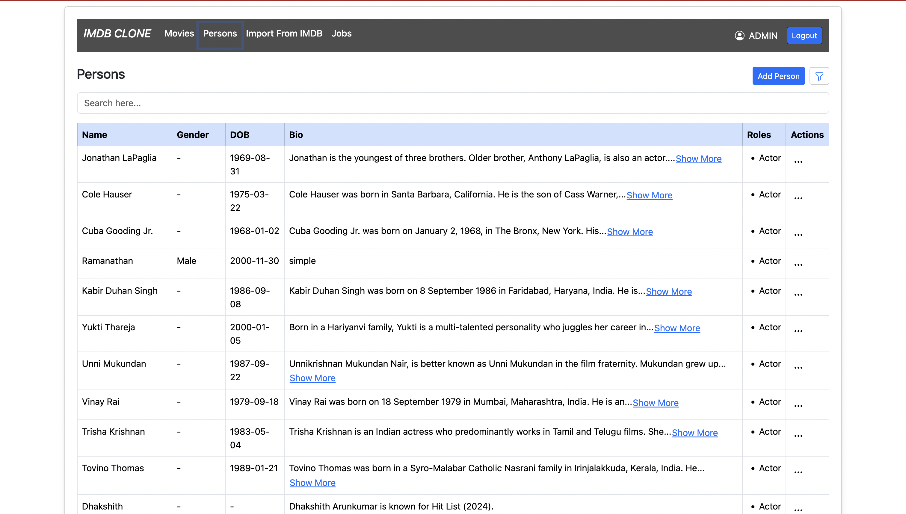
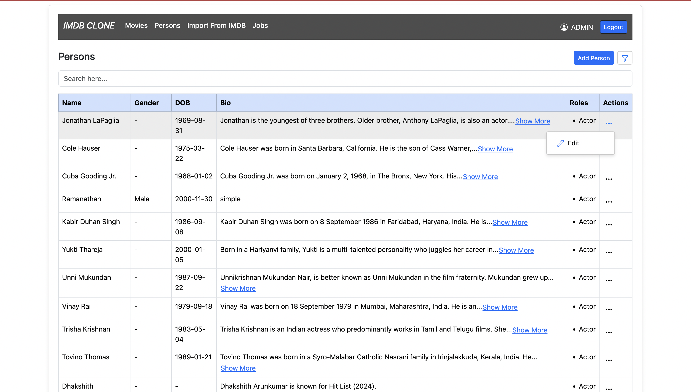
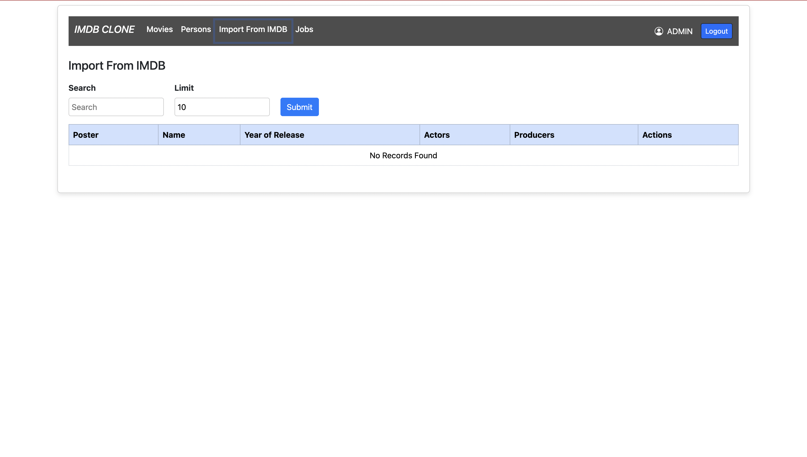
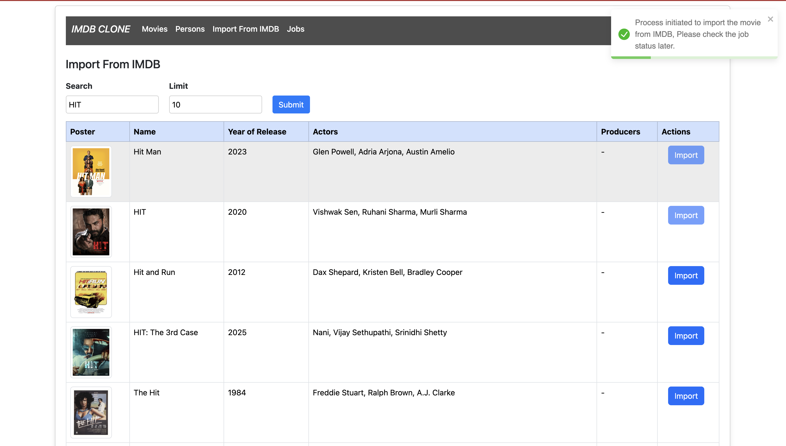

# IMDb Clone - Question 3

This is a IMDB Clone Project. It is designed to replicate core functionalities of the IMDb platform, allowing users to explore and interact with movie-related data.

## Features

- **Movie Listings**: Display a list of movies with details like title, genre, and release year.
- **Search Functionality**: Search for movies by title or genre.
- **Movie Details**: View detailed information about a specific movie.
- **User Ratings**: Add and view user ratings for movies.
- **Responsive Design**: Optimized for both desktop and mobile devices.

## Installation

1. Clone the repository:
    ```bash
    git clone <repository-url>
    ```
2. Navigate to the project directory:
    ```bash
    cd imdbCloneQ3
    ```
3. Install dependencies:
    ```bash
    npm install
    ```

## Usage

1. Start the development server:
    ```bash
    npm start
    ```
2. Open your browser and navigate to:
    ```
    http://localhost:3000
    ```

## Technologies Used

- **Frontend**: React, CSS
- **Backend**: Node.js, Express
- **Database**: MongoDB
- **Others**: Axios, Redux (if applicable)

## Folder Structure

```
imdbCloneQ3/
├── public/
├── src/
│   ├── components/
│   ├── pages/
│   ├── services/
│   ├── utils/
│   └── App.js
├── README.md
└── package.json
```
## Screenshots

### Screenshots

Here are some screenshots of the application:

#### Home Page


#### Add a Movie


#### Movies Options Bar


#### Edit a Movie


#### List all Persons


#### Add Persons


#### Persons Options Bar


#### Edit Persons


#### Import From IMDB Server


#### Import Process Initiated


#### Imported Movie Listing


#### Edit Imported Movie 


## License

This project is licensed under the [MIT License](LICENSE).

## Contact

For any questions or feedback, please reach out to the project maintainer.
M Ramanathan
+91 8056856956
rsai48838@gmail.com
